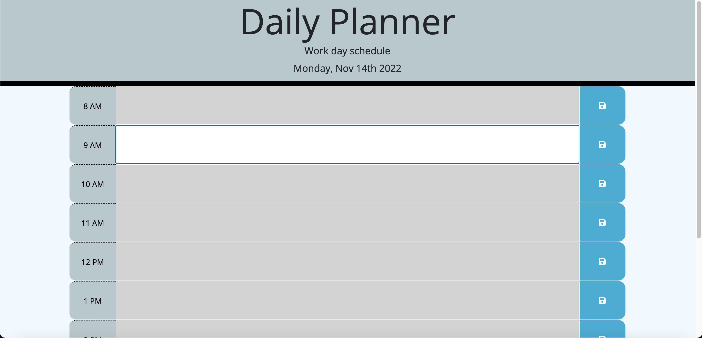

# Daily-planner-project

A challenge to create a workday schedule.

## Description

A workday schedule that provides indicators for date and time. It also shows time slots in the day that indicates whether the time slot is in the past, present, or has yet to pass. You can also add text to the slots and save.

## Mock up

## Link to application

[https://abranr84.github.io/Daily-planner-project/](https://abranr84.github.io/Daily-planner-project/)